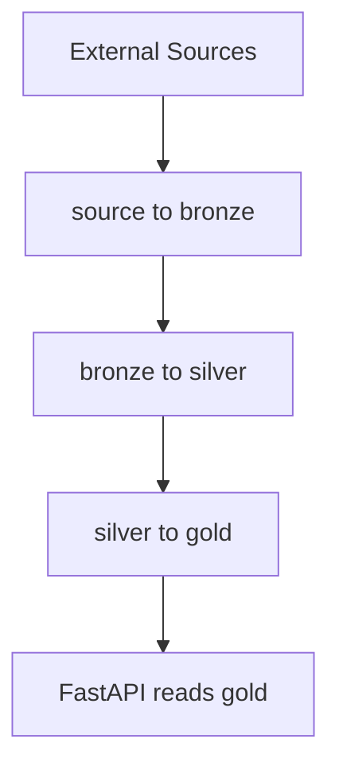

# IBRVN Sermon Platform

Searchable sermon archive for Igreja Batista Reformada Vida Nova.

The project ingests historical WordPress data and modern YouTube data, processes
them through a medallion-style pipeline, stores a curated gold dataset in
PostgreSQL, and serves the final archive through a FastAPI web app.

## Current Architecture

The homelab runtime is intentionally split:

- `api/` serves the web interface and reads gold data only
- `pipe/` owns ingestion, transformation, enrichment, and operational jobs
- `shared/` contains the common database and settings modules

`preaching_date` remains the canonical business key for a sermon. If a
technical `sermon_id` is introduced later, it should stay in a 1:1
relationship with `preaching_date`.

## Repository Layout

```text
ibrvn-archive/
  api/
    Dockerfile
    main.py
    db.py
    queries.py
    requirements.txt
    templates/
    static/
  pipe/
    Dockerfile
    requirements.txt
    jobs/
    pipelines/
      bronze/
      silver/
      gold/
    config/
    scripts/
  shared/
    db.py
    settings.py
  docs/
  compose.yaml
  Makefile
```

## Data Flow



Current sources:

- WordPress XML export for the historical archive
- YouTube Data API v3 for ongoing sermon ingestion

Current orchestration shape in `homelab-airflow`:

- `ibrvn_youtube_bronze_historic`
- `ibrvn_youtube_bronze_weekly`
- `ibrvn_wordpress_historic`
- `ibrvn_metadata_silver`
- `ibrvn_audio_enrichment`
- `ibrvn_gold_refresh`

## Data Model

The curated gold layer contains one unified sermon row per `preaching_date`.
That row can merge multiple source references at the same time, such as
YouTube, WordPress, and audio links.

Silver is stored in PostgreSQL tables, not CSV files. The current silver model
is centered on:

- `silver_source_items`
- `silver_sermon_metadata`
- `silver_media_assets`
- `silver_transcripts`
- `silver_summaries`
- `silver_processing_runs`

Audio enrichment now calls the separate `homelab-ai` runtime for:

- local transcription with `faster-whisper`
- local summarization with Ollama

The sermon critique email flow is separate from that stack and calls the
OpenAI API directly from `ibrvn-archive`.

Current core fields:

- `preaching_date`
- `preacher_name`
- `title`
- `text_reference`
- `serie`
- `youtube_link`
- `wordpress_link`
- `media_link`
- `download_link`

## Running

Start the homelab stack:

```bash
docker compose up -d --build
```

For local transcription and summary, start `homelab-ai` separately before
running the audio enrichment pipeline.

Run the API locally:

```bash
make api
```

Run pipeline jobs manually:

```bash
make job-youtube-weekly
make job-youtube-historic
make job-wordpress-historic
```

Utility commands:

```bash
make quality
make export
make migrate-gold-postgres
```

## Airflow

`homelab-airflow` orchestrates the existing pipeline runtime by executing
commands inside the dedicated `ibrvn-archive-pipelines` container.

This is the current transitional model before moving to container-per-task
execution.

## Notes

- The API container does not need `YOUTUBE_API_KEY`.
- The pipeline container owns ingestion credentials and heavier dependencies.
- Bronze stays on disk for source snapshots and raw files.
- Silver and gold are stored in PostgreSQL in the homelab deployment.
- Audio enrichment writes duration, transcript, and summary outputs into silver tables.
- Local AI inference for audio enrichment is expected to run in the separate `homelab-ai` stack.
- Sermon critique email generation uses the OpenAI API directly.

## Docs

- [docs/homelab-migration.md](/D:/Desenvolvimento/homelab/ibrvn-archive/docs/homelab-migration.md)
- [docs/api-pipelines-split-plan.md](/D:/Desenvolvimento/homelab/ibrvn-archive/docs/api-pipelines-split-plan.md)
